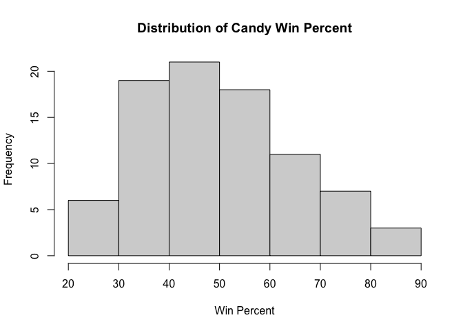
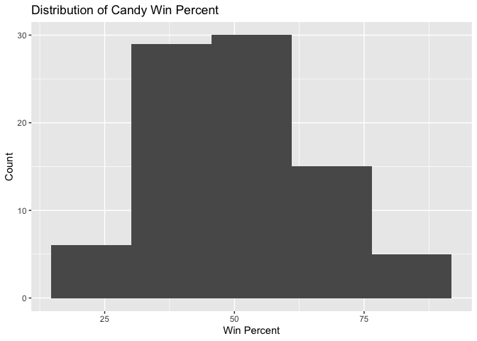
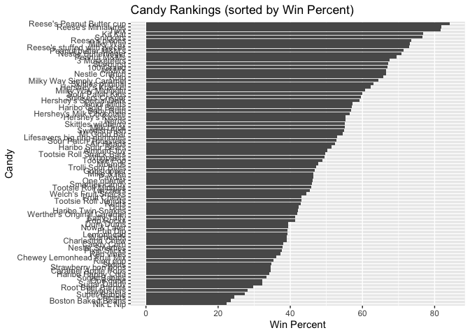
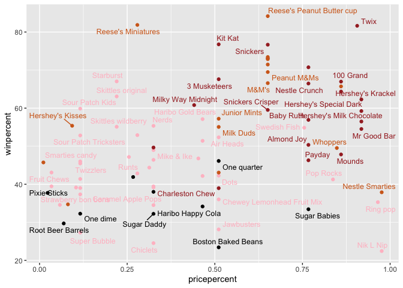
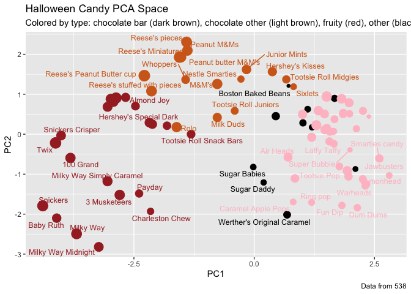

# Class 9 Halloween Candy Project
Joshua Khalil (A17784122)

- [Background](#background)
- [Data Import](#data-import)
- [What is your favorite Candy](#what-is-your-favorite-candy)
- [Exploratory analysis](#exploratory-analysis)
- [Overall Candy Rankings](#overall-candy-rankings)
- [5 Taking a look at pricepercent](#5-taking-a-look-at-pricepercent)
- [Exploring the correlation
  structure](#exploring-the-correlation-structure)
- [Principal Component Analysis](#principal-component-analysis)
- [Summary](#summary)

## Background

In this mini project, you will explore FiveThirtyEight’s Halloween Candy
dataset.

## Data Import

Our data set is a CSV file, we first need to get the data from the
FiveThirtyEight GitHub repo.

``` r
candy<- read.csv("candy-data.csv", row.names=1)
head(candy)
```

                 chocolate fruity caramel peanutyalmondy nougat crispedricewafer
    100 Grand            1      0       1              0      0                1
    3 Musketeers         1      0       0              0      1                0
    One dime             0      0       0              0      0                0
    One quarter          0      0       0              0      0                0
    Air Heads            0      1       0              0      0                0
    Almond Joy           1      0       0              1      0                0
                 hard bar pluribus sugarpercent pricepercent winpercent
    100 Grand       0   1        0        0.732        0.860   66.97173
    3 Musketeers    0   1        0        0.604        0.511   67.60294
    One dime        0   0        0        0.011        0.116   32.26109
    One quarter     0   0        0        0.011        0.511   46.11650
    Air Heads       0   0        0        0.906        0.511   52.34146
    Almond Joy      0   1        0        0.465        0.767   50.34755

> Q1. How many different candy types are in this dataset?

``` r
nrow(candy)
```

    [1] 85

> Q2. How many fruity candy types are in the dataset?

``` r
sum(candy$fruity == 1)
```

    [1] 38

One of the most interesting variables in the dataset is `winpercent`.
For a given candy this value is the percentage of people who prefer this
candy over another randomly chosen candy from the dataset (what 538 term
a matchup). Higher values indicate a more popular candy.

``` r
candy["Twix", ]$winpercent
```

    [1] 81.64291

## What is your favorite Candy

> Q3. What is your favorite candy (other than Twix) in the dataset and
> what is it’s winpercent value?

My favorite candy is Almond Joy

``` r
candy["Almond Joy", ]$winpercent
```

    [1] 50.34755

> Q4. What is the winpercent value for “Kit Kat”?

The winpercent for kitcat is 76.7686

``` r
candy["Kit Kat", ]$winpercent
```

    [1] 76.7686

> Q5. What is the winpercent value for “Tootsie Roll Snack Bars”?

The winpercent for Tootsie Roll Snack Bars is 49.6535.  
.

``` r
candy["Tootsie Roll Snack Bars", ]$winpercent 
```

    [1] 49.6535

There is a useful skim() function in the skimr package that can help
give you a quick overview of a given dataset. Let’s install this package
and try it on our candy data.

``` r
library("skimr")
skim(candy)
```

|                                                  |       |
|:-------------------------------------------------|:------|
| Name                                             | candy |
| Number of rows                                   | 85    |
| Number of columns                                | 12    |
| \_\_\_\_\_\_\_\_\_\_\_\_\_\_\_\_\_\_\_\_\_\_\_   |       |
| Column type frequency:                           |       |
| numeric                                          | 12    |
| \_\_\_\_\_\_\_\_\_\_\_\_\_\_\_\_\_\_\_\_\_\_\_\_ |       |
| Group variables                                  | None  |

Data summary

**Variable type: numeric**

| skim_variable | n_missing | complete_rate | mean | sd | p0 | p25 | p50 | p75 | p100 | hist |
|:---|---:|---:|---:|---:|---:|---:|---:|---:|---:|:---|
| chocolate | 0 | 1 | 0.44 | 0.50 | 0.00 | 0.00 | 0.00 | 1.00 | 1.00 | ▇▁▁▁▆ |
| fruity | 0 | 1 | 0.45 | 0.50 | 0.00 | 0.00 | 0.00 | 1.00 | 1.00 | ▇▁▁▁▆ |
| caramel | 0 | 1 | 0.16 | 0.37 | 0.00 | 0.00 | 0.00 | 0.00 | 1.00 | ▇▁▁▁▂ |
| peanutyalmondy | 0 | 1 | 0.16 | 0.37 | 0.00 | 0.00 | 0.00 | 0.00 | 1.00 | ▇▁▁▁▂ |
| nougat | 0 | 1 | 0.08 | 0.28 | 0.00 | 0.00 | 0.00 | 0.00 | 1.00 | ▇▁▁▁▁ |
| crispedricewafer | 0 | 1 | 0.08 | 0.28 | 0.00 | 0.00 | 0.00 | 0.00 | 1.00 | ▇▁▁▁▁ |
| hard | 0 | 1 | 0.18 | 0.38 | 0.00 | 0.00 | 0.00 | 0.00 | 1.00 | ▇▁▁▁▂ |
| bar | 0 | 1 | 0.25 | 0.43 | 0.00 | 0.00 | 0.00 | 0.00 | 1.00 | ▇▁▁▁▂ |
| pluribus | 0 | 1 | 0.52 | 0.50 | 0.00 | 0.00 | 1.00 | 1.00 | 1.00 | ▇▁▁▁▇ |
| sugarpercent | 0 | 1 | 0.48 | 0.28 | 0.01 | 0.22 | 0.47 | 0.73 | 0.99 | ▇▇▇▇▆ |
| pricepercent | 0 | 1 | 0.47 | 0.29 | 0.01 | 0.26 | 0.47 | 0.65 | 0.98 | ▇▇▇▇▆ |
| winpercent | 0 | 1 | 50.32 | 14.71 | 22.45 | 39.14 | 47.83 | 59.86 | 84.18 | ▃▇▆▅▂ |

> Q6. Is there any variable/column that looks to be on a different scale
> to the majority of the other columns in the dataset?

Yes! Winpercent

> Q7. What do you think a zero and one represent for the
> candy\$chocolate column?

1 means the candy contains chocolate 0 means the candy does NOT contain
chocolate

## Exploratory analysis

A good place to start any exploratory analysis is with a histogram. You
can do this most easily with the base R function hist(). Alternatively,
you can use ggplot() with geom_hist(). Either works well in this case
and (as always) its your choice.

> Q8. Plot a histogram of winpercent values

Base R

``` r
hist(candy$winpercent,
     main = "Distribution of Candy Win Percent",
     xlab = "Win Percent",
     breaks = )
```



GGplot

``` r
library(ggplot2)

ggplot(candy, aes(x = winpercent)) +
  geom_histogram(bins=5) +
  labs(title = "Distribution of Candy Win Percent",
       x = "Win Percent",
       y = "Count")
```



> Q9. Is the distribution of winpercent values symmetrical?

The distribution is not perfectly symmetrical. It is typically
right-skewed, with more candies clustered around the middle/lower values
and a smaller number of very popular candies with high winpercent
values.

> Q10. Is the center of the distribution above or below 50%?

``` r
mean(candy$winpercent)
```

    [1] 50.31676

``` r
median(candy$winpercent)
```

    [1] 47.82975

> Q11. On average is chocolate candy higher or lower ranked than fruit
> candy?

``` r
aggregate(winpercent ~ chocolate, data = candy, mean)
```

      chocolate winpercent
    1         0   42.14226
    2         1   60.92153

> Q12. Is this difference statistically significant

``` r
t.test(winpercent ~ chocolate, data = candy)
```


        Welch Two Sample t-test

    data:  winpercent by chocolate
    t = -7.3031, df = 67.539, p-value = 4.164e-10
    alternative hypothesis: true difference in means between group 0 and group 1 is not equal to 0
    95 percent confidence interval:
     -23.91110 -13.64744
    sample estimates:
    mean in group 0 mean in group 1 
           42.14226        60.92153 

The P value was much smaller than 0.05 meaning it did differ
significantly. Chocolate candies have a significantly higher average
winpercent than fruity candies, and this difference is statistically
significant based on a two-sample t-test

## Overall Candy Rankings

Let’s use the base R `order()` function together with `head()` to sort
the whole dataset by winpercent. Or if you have been getting into the
tidyverse and the dplyr package you can use the `arrange()` function
together with `head()` to do the same thing and answer the following
questions:

> Q13. What are the five least liked candy types in this set?

Nik L Nip, Boston Baked Beans, Chiclets, Super Bubble, and Jawbusters
are the least liked candys.

``` r
head(candy[order(candy$winpercent),], n=5)
```

                       chocolate fruity caramel peanutyalmondy nougat
    Nik L Nip                  0      1       0              0      0
    Boston Baked Beans         0      0       0              1      0
    Chiclets                   0      1       0              0      0
    Super Bubble               0      1       0              0      0
    Jawbusters                 0      1       0              0      0
                       crispedricewafer hard bar pluribus sugarpercent pricepercent
    Nik L Nip                         0    0   0        1        0.197        0.976
    Boston Baked Beans                0    0   0        1        0.313        0.511
    Chiclets                          0    0   0        1        0.046        0.325
    Super Bubble                      0    0   0        0        0.162        0.116
    Jawbusters                        0    1   0        1        0.093        0.511
                       winpercent
    Nik L Nip            22.44534
    Boston Baked Beans   23.41782
    Chiclets             24.52499
    Super Bubble         27.30386
    Jawbusters           28.12744

> Q14. What are the top 5 all-time favorite candy types?

The top five all times are Reese’s Peanut Butter cup, Reese’s
Miniatures, Twix,Kit Kat and Snickers

``` r
head(candy[order(candy$winpercent, decreasing = TRUE), ], 5)
```

                              chocolate fruity caramel peanutyalmondy nougat
    Reese's Peanut Butter cup         1      0       0              1      0
    Reese's Miniatures                1      0       0              1      0
    Twix                              1      0       1              0      0
    Kit Kat                           1      0       0              0      0
    Snickers                          1      0       1              1      1
                              crispedricewafer hard bar pluribus sugarpercent
    Reese's Peanut Butter cup                0    0   0        0        0.720
    Reese's Miniatures                       0    0   0        0        0.034
    Twix                                     1    0   1        0        0.546
    Kit Kat                                  1    0   1        0        0.313
    Snickers                                 0    0   1        0        0.546
                              pricepercent winpercent
    Reese's Peanut Butter cup        0.651   84.18029
    Reese's Miniatures               0.279   81.86626
    Twix                             0.906   81.64291
    Kit Kat                          0.511   76.76860
    Snickers                         0.651   76.67378

> Q15. Make a first barplot of candy ranking based on winpercent values

``` r
library(ggplot2)

ggplot(candy) + 
  aes(winpercent, rownames(candy)) +
  geom_col()
```


> Q16. This is quite ugly, use the reorder() function to get the bars
> sorted by winpercent?

``` r
library(ggplot2)

ggplot(candy) + 
  aes(winpercent, reorder(rownames(candy), winpercent)) +
  geom_col() +
  labs(x = "Win Percent", y = "Candy",
       title = "Candy Rankings (sorted by Win Percent)")
```



``` r
my_cols=rep("black", nrow(candy))
my_cols[as.logical(candy$chocolate)] = "chocolate"
my_cols[as.logical(candy$bar)] = "brown"
my_cols[as.logical(candy$fruity)] = "pink"
```

Now let’s add some color that signifies candy type

``` r
ggplot(candy) + 
  aes(winpercent, reorder(rownames(candy),winpercent)) +
  geom_col(fill=my_cols)
```


Now, for the first time, using this plot we can answer questions like:

> Q17. What is the worst ranked chocolate candy?

Sixlets

> Q18. What is the best ranked fruity candy?

Starburts

## 5 Taking a look at pricepercent

What about value for money? What is the best candy for the least money?
One way to get at this would be to make a plot of winpercent vs the
pricepercent variable. The pricepercent variable records the percentile
rank of the candy’s price against all the other candies in the dataset.
Lower values are less expensive and higher values are more

``` r
library(ggrepel)

ggplot(candy) +
  aes(pricepercent, winpercent, label=rownames(candy)) +
  geom_point(col=my_cols) + 
  geom_text_repel(col=my_cols, size=3.3, max.overlaps = 5)
```



> Q19. Which candy type is the highest ranked in terms of winpercent for
> the least money - i.e. offers the most bang for your buck?

Reese Miniature offers most bang for buck, providing high winpercent and
low pricepercent.

> Q20. What are the top 5 most expensive candy types in the dataset and
> of these which is the least popular?

``` r
expensive <- candy[order(candy$pricepercent, decreasing = TRUE), ]
top5_expensive <- head(expensive, 5)
top5_expensive
```

                             chocolate fruity caramel peanutyalmondy nougat
    Nik L Nip                        0      1       0              0      0
    Nestle Smarties                  1      0       0              0      0
    Ring pop                         0      1       0              0      0
    Hershey's Krackel                1      0       0              0      0
    Hershey's Milk Chocolate         1      0       0              0      0
                             crispedricewafer hard bar pluribus sugarpercent
    Nik L Nip                               0    0   0        1        0.197
    Nestle Smarties                         0    0   0        1        0.267
    Ring pop                                0    1   0        0        0.732
    Hershey's Krackel                       1    0   1        0        0.430
    Hershey's Milk Chocolate                0    0   1        0        0.430
                             pricepercent winpercent
    Nik L Nip                       0.976   22.44534
    Nestle Smarties                 0.976   37.88719
    Ring pop                        0.965   35.29076
    Hershey's Krackel               0.918   62.28448
    Hershey's Milk Chocolate        0.918   56.49050

``` r
top5_expensive[which.min(top5_expensive$winpercent), ]
```

              chocolate fruity caramel peanutyalmondy nougat crispedricewafer hard
    Nik L Nip         0      1       0              0      0                0    0
              bar pluribus sugarpercent pricepercent winpercent
    Nik L Nip   0        1        0.197        0.976   22.44534

Nik L Nip is the least popular of the expensive candy.

## Exploring the correlation structure

``` r
library(corrplot)
```

    corrplot 0.95 loaded

``` r
cij <- cor(candy)
corrplot(cij)
```


> Q22. Examining this plot what two variables are anti-correlated
> (i.e. have minus values)?

Chocolate and fruity are most negatively correlated

> Q23. Similarly, what two variables are most positively correlated?

Chocolate and winpercent are the most positively correlated.

## Principal Component Analysis

Let’s apply PCA using the prcomp() function to our candy dataset
remembering to set the scale=TRUE argument.

``` r
pca <- prcomp(candy, scale=T)
summary(pca)
```

    Importance of components:
                              PC1    PC2    PC3     PC4    PC5     PC6     PC7
    Standard deviation     2.0788 1.1378 1.1092 1.07533 0.9518 0.81923 0.81530
    Proportion of Variance 0.3601 0.1079 0.1025 0.09636 0.0755 0.05593 0.05539
    Cumulative Proportion  0.3601 0.4680 0.5705 0.66688 0.7424 0.79830 0.85369
                               PC8     PC9    PC10    PC11    PC12
    Standard deviation     0.74530 0.67824 0.62349 0.43974 0.39760
    Proportion of Variance 0.04629 0.03833 0.03239 0.01611 0.01317
    Cumulative Proportion  0.89998 0.93832 0.97071 0.98683 1.00000

``` r
plot(pca$x[, 1], pca$x[, 2], xlab = "PC1", ylab = "PC2")
```


We can change the plotting character and add some color

``` r
plot(pca$x[,1:2], col=my_cols, pch=16)
```


We can make a much nicer plot with the ggplot2 package but it is
important to note that ggplot works best when you supply an input
data.frame that includes a separate column for each of the aesthetics
you would like displayed in your final plot. To accomplish this we make
a new data.frame here that contains our PCA results with all the rest of
our candy data. We will then use this for making plots below

``` r
my_data <- cbind(candy, pca$x[,1:3])

p <- ggplot(my_data) + 
        aes(x=PC1, y=PC2, 
            size=winpercent/100,  
            text=rownames(my_data),
            label=rownames(my_data)) +
        geom_point(col=my_cols)

p
```


``` r
library(ggrepel)

p + geom_text_repel(size=3.3, col=my_cols, max.overlaps = 7)  + 
  theme(legend.position = "none") +
  labs(title="Halloween Candy PCA Space",
       subtitle="Colored by type: chocolate bar (dark brown), chocolate other (light brown), fruity (red), other (black)",
       caption="Data from 538")
```



``` r
#library(plotly)
#ggplotly(p)
```

Let’s finish by taking a quick look at PCA our loadings. Do these make
sense to you? Notice the opposite effects of chocolate and fruity and
the similar effects of chocolate and bar (i.e. we already know they are
correlated).

> Q24. Complete the code to generate the loadings plot above. What
> original variables are picked up strongly by PC1 in the positive
> direction? Do these make sense to you? Where did you see this
> relationship highlighted previously?

``` r
ggplot(pca$rotation) +
  aes(x = PC1, y = reorder(rownames(pca$rotation), PC1)) +
  geom_col()
```


Fruity, pluribus, and hard load strongly in the positive direction of
PC1. This makes sense because PC1 separates fruity and hard candies from
chocolate and bar candies, a relationship that was previously evident in
the correlation analysis and earlier exploratory plots.

## Summary

The correlation analysis showed you how candy attributes relate to each
other (chocolate and fruity are essentially mutually exclusive, for
instance), and this set the stage for PCA. By reducing the original
variables down to a few PCs, you created a “map of candy space” where
similar candies cluster together. The PCA loadings revealed that the
primary axis of variation separates chocolate-based candies from fruity
ones - the same pattern we observed in the correlation matrix, now
visualized in a single, interpretable plot

> Q25. Based on your exploratory analysis, correlation findings, and PCA
> results, what combination of characteristics appears to make a
> “winning” candy? How do these different analyses (visualization,
> correlation, PCA) support or complement each other in reaching this
> conclusion?

“winning” candy in this dataset appears to be chocolate-based,
bar-style, and not fruity, with additional features like caramel,
peanut/almond, or wafer components These candies tend to have high
winpercent values, even when their price is not the lowest, suggesting
that consumers are willing to prefer chocolate-forward candies overall.
