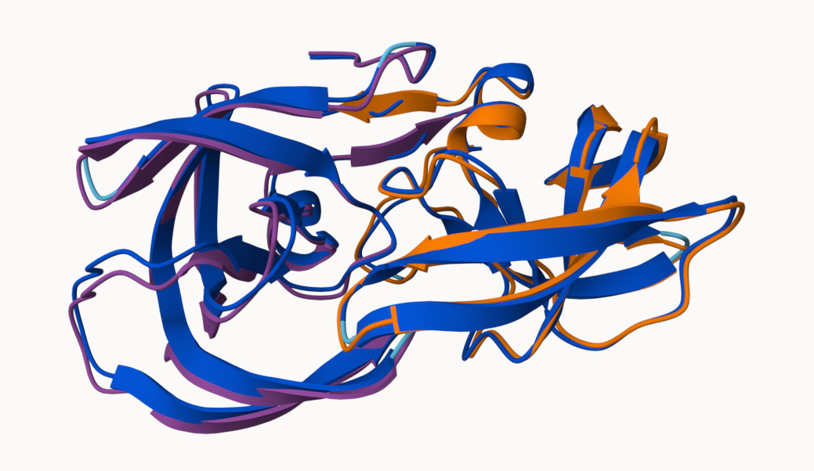
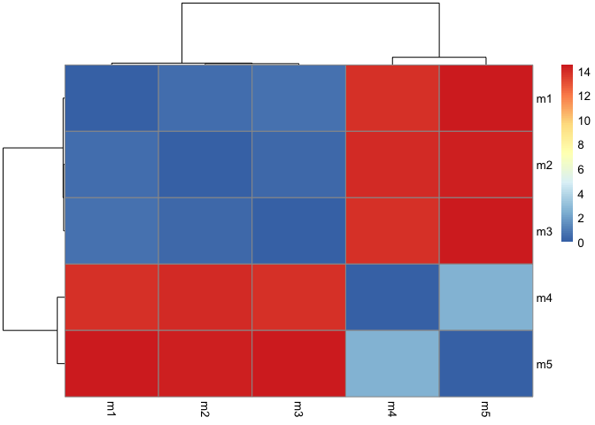
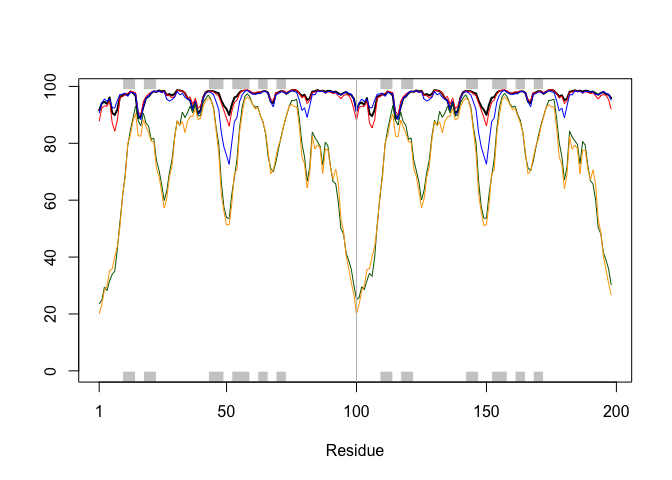
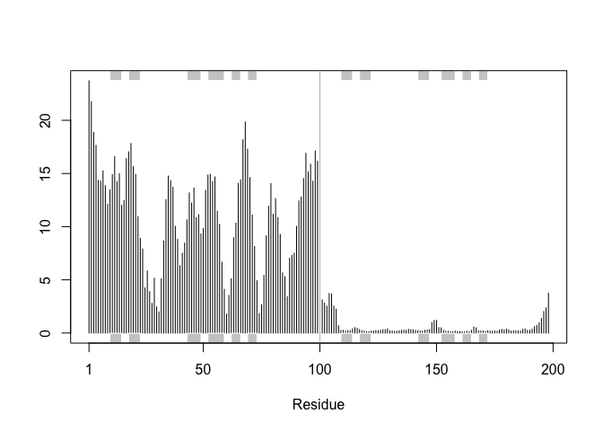
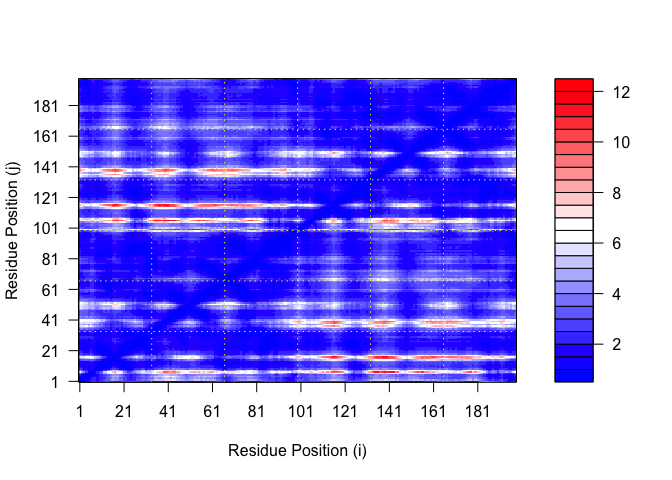
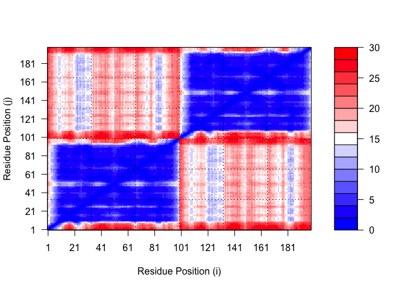
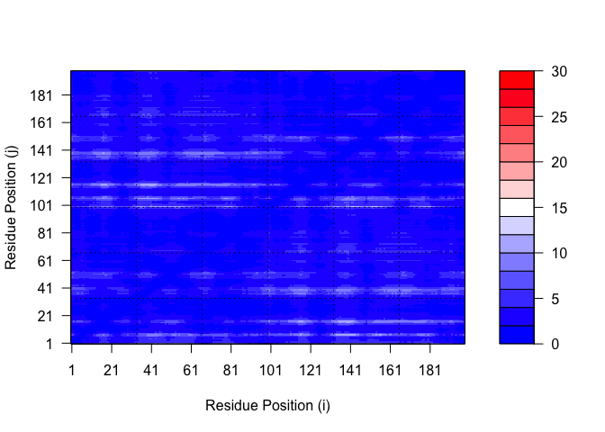

# Class 11 Alphafold
Joshua Khalil (A17784122)

- [Background](#background)
- [Alphafold](#alphafold)
- [EBI Alphafold database](#ebi-alphafold-database)
- [Running AlphaFold](#running-alphafold)
- [Custom analysis of resulting
  models](#custom-analysis-of-resulting-models)
- [Predicted Alignment Error for
  domains](#predicted-alignment-error-for-domains)
- [Residue conservation from alignment
  file](#residue-conservation-from-alignment-file)

## Background

we saw last data that the main repository for biomolecular structure
(the pdb database) only has ~250,000 entries.

UniPortKB has over 200 million entries

## Alphafold

In this hands on session we will utilize alphafold to predict protein
structure from sequence

Without the aid of such approaches it can take years of expensive
laboratory work to determine the structure of just one protein. With
AlphaFold we can now accurately compute a typical protein structure in
as little as ten minutes.

## EBI Alphafold database

The EBI Alphafold database contains lots of computed structure models.
It increasingly likely that the structures you are interested in is
already in the database. at <https://alphafold.ebi.ac.uk/>

There are three major outputs from alphafold

1.  A model of structure in **PDB** format
2.  a **pLDDT score**: that tells us how confident the model is for a
    given residue in your protein (high values are good above 70)
3.  a **PAE score** that tels us about protein packing quality.

If you can not find a matching entry for the sequence you are interested
in AFDB you can run Alphafold yourself

## Running AlphaFold

If you can’t find an existing structure of interest in the PDB or AFDB
then you can generate your own structure predictions with ColabFold
<https://colab.research.google.com/github/sokrypton/ColabFold/blob/main/AlphaFold2.ipynb>



## Custom analysis of resulting models

In this section we will read the results of the more complicated HIV-Pr
dimer AlphaFold2 models into R with the help of the Bio3D package. You
can do the same thing for the monomer models if you wish but again they
will be less interesting as the monomer is not physiologically relevant.

For tidiness we can move our AlphaFold results directory into our
RStudio project directory. In this example my results are in the
director `results_dir` (set below). You should change this to match your
directory/folder name.

``` r
library(bio3d)
results_dir <- "hivpr_23119"
p <- read.pdb("hivpr_23119/")
pdb_files <- list.files(path=results_dir,
                        pattern="*.pdb",
                        full.names = TRUE)
```

``` r
pdb_files <-list.files("hivpr_23119", pattern=".pdb", full.names = T)
```

``` r
pdbs <- pdbaln(pdb_files, fit=TRUE, exefile="msa")
```

    Reading PDB files:
    hivpr_23119/HIVpr_23119_unrelaxed_rank_001_alphafold2_multimer_v3_model_4_seed_000.pdb
    hivpr_23119/HIVpr_23119_unrelaxed_rank_002_alphafold2_multimer_v3_model_1_seed_000.pdb
    hivpr_23119/HIVpr_23119_unrelaxed_rank_003_alphafold2_multimer_v3_model_5_seed_000.pdb
    hivpr_23119/HIVpr_23119_unrelaxed_rank_004_alphafold2_multimer_v3_model_2_seed_000.pdb
    hivpr_23119/HIVpr_23119_unrelaxed_rank_005_alphafold2_multimer_v3_model_3_seed_000.pdb
    .....

    Extracting sequences

    pdb/seq: 1   name: hivpr_23119/HIVpr_23119_unrelaxed_rank_001_alphafold2_multimer_v3_model_4_seed_000.pdb 
    pdb/seq: 2   name: hivpr_23119/HIVpr_23119_unrelaxed_rank_002_alphafold2_multimer_v3_model_1_seed_000.pdb 
    pdb/seq: 3   name: hivpr_23119/HIVpr_23119_unrelaxed_rank_003_alphafold2_multimer_v3_model_5_seed_000.pdb 
    pdb/seq: 4   name: hivpr_23119/HIVpr_23119_unrelaxed_rank_004_alphafold2_multimer_v3_model_2_seed_000.pdb 
    pdb/seq: 5   name: hivpr_23119/HIVpr_23119_unrelaxed_rank_005_alphafold2_multimer_v3_model_3_seed_000.pdb 

``` r
#library(bio3dview)
#view.pdbs(pdbs)
```

How similar or different are my models?

``` r
rd <-rmsd(pdbs, fit=T)
```

    Warning in rmsd(pdbs, fit = T): No indices provided, using the 198 non NA positions

``` r
range(rd)
```

    [1]  0.000 14.526

``` r
library(pheatmap)
colnames(rd) <- paste0("m",1:5)
rownames(rd) <- paste0("m",1:5)
pheatmap(rd)
```



Now lets plot the pLDDT values across all models. Recall that this
information is in the B-factor column of each model and that this is
stored in our aligned pdbs object as `pdbs$b` with a row per
structure/model.

``` r
# Read a reference PDB structure
pdb <- read.pdb("1hsg")
```

      Note: Accessing on-line PDB file

``` r
plotb3(pdbs$b[1,], typ="l", lwd=2, sse=pdb)
points(pdbs$b[2,], typ="l", col="red")
points(pdbs$b[3,], typ="l", col="blue")
points(pdbs$b[4,], typ="l", col="darkgreen")
points(pdbs$b[5,], typ="l", col="orange")
abline(v=100, col="gray")
```



We can improve the superposition/fitting of our models by finding the
most consistent “rigid core” common across all the models. For this we
will use the core.find() function:

``` r
core <- core.find(pdbs)
```

     core size 197 of 198  vol = 5311.905 
     core size 196 of 198  vol = 4622.32 
     core size 195 of 198  vol = 1803.028 
     core size 194 of 198  vol = 1106.755 
     core size 193 of 198  vol = 1033.427 
     core size 192 of 198  vol = 985.198 
     core size 191 of 198  vol = 939.616 
     core size 190 of 198  vol = 896.766 
     core size 189 of 198  vol = 856.252 
     core size 188 of 198  vol = 822.829 
     core size 187 of 198  vol = 791.898 
     core size 186 of 198  vol = 762.687 
     core size 185 of 198  vol = 739.51 
     core size 184 of 198  vol = 712.268 
     core size 183 of 198  vol = 688.778 
     core size 182 of 198  vol = 669.224 
     core size 181 of 198  vol = 633.377 
     core size 180 of 198  vol = 614.667 
     core size 179 of 198  vol = 598.623 
     core size 178 of 198  vol = 582.74 
     core size 177 of 198  vol = 567.927 
     core size 176 of 198  vol = 553.536 
     core size 175 of 198  vol = 535.287 
     core size 174 of 198  vol = 522.628 
     core size 173 of 198  vol = 493.693 
     core size 172 of 198  vol = 479.665 
     core size 171 of 198  vol = 462.315 
     core size 170 of 198  vol = 448.76 
     core size 169 of 198  vol = 433.241 
     core size 168 of 198  vol = 420.053 
     core size 167 of 198  vol = 410.378 
     core size 166 of 198  vol = 398.085 
     core size 165 of 198  vol = 387.24 
     core size 164 of 198  vol = 373.948 
     core size 163 of 198  vol = 362.751 
     core size 162 of 198  vol = 348.611 
     core size 161 of 198  vol = 336.713 
     core size 160 of 198  vol = 324.778 
     core size 159 of 198  vol = 314.115 
     core size 158 of 198  vol = 302.268 
     core size 157 of 198  vol = 291.431 
     core size 156 of 198  vol = 280.553 
     core size 155 of 198  vol = 271.537 
     core size 154 of 198  vol = 262.651 
     core size 153 of 198  vol = 253.338 
     core size 152 of 198  vol = 244.266 
     core size 151 of 198  vol = 235.874 
     core size 150 of 198  vol = 228.071 
     core size 149 of 198  vol = 216.409 
     core size 148 of 198  vol = 203.865 
     core size 147 of 198  vol = 193.565 
     core size 146 of 198  vol = 185.893 
     core size 145 of 198  vol = 178.463 
     core size 144 of 198  vol = 170.348 
     core size 143 of 198  vol = 163.308 
     core size 142 of 198  vol = 153.436 
     core size 141 of 198  vol = 143.699 
     core size 140 of 198  vol = 137.681 
     core size 139 of 198  vol = 132.232 
     core size 138 of 198  vol = 124.684 
     core size 137 of 198  vol = 117.401 
     core size 136 of 198  vol = 109.876 
     core size 135 of 198  vol = 104.889 
     core size 134 of 198  vol = 98.885 
     core size 133 of 198  vol = 95.016 
     core size 132 of 198  vol = 91.683 
     core size 131 of 198  vol = 87.816 
     core size 130 of 198  vol = 84.046 
     core size 129 of 198  vol = 79.701 
     core size 128 of 198  vol = 76.896 
     core size 127 of 198  vol = 73.948 
     core size 126 of 198  vol = 70.293 
     core size 125 of 198  vol = 66.763 
     core size 124 of 198  vol = 64.12 
     core size 123 of 198  vol = 60.644 
     core size 122 of 198  vol = 57.631 
     core size 121 of 198  vol = 53.838 
     core size 120 of 198  vol = 50.347 
     core size 119 of 198  vol = 46.207 
     core size 118 of 198  vol = 43.507 
     core size 117 of 198  vol = 39.709 
     core size 116 of 198  vol = 36.796 
     core size 115 of 198  vol = 34.65 
     core size 114 of 198  vol = 31.443 
     core size 113 of 198  vol = 28.79 
     core size 112 of 198  vol = 26.627 
     core size 111 of 198  vol = 24.28 
     core size 110 of 198  vol = 22.088 
     core size 109 of 198  vol = 20.127 
     core size 108 of 198  vol = 18.254 
     core size 107 of 198  vol = 16.785 
     core size 106 of 198  vol = 15.453 
     core size 105 of 198  vol = 14.137 
     core size 104 of 198  vol = 12.84 
     core size 103 of 198  vol = 11.04 
     core size 102 of 198  vol = 10.012 
     core size 101 of 198  vol = 9.055 
     core size 100 of 198  vol = 8.017 
     core size 99 of 198  vol = 7.503 
     core size 98 of 198  vol = 6.268 
     core size 97 of 198  vol = 5.279 
     core size 96 of 198  vol = 4.152 
     core size 95 of 198  vol = 3.452 
     core size 94 of 198  vol = 2.854 
     core size 93 of 198  vol = 2.266 
     core size 92 of 198  vol = 1.944 
     core size 91 of 198  vol = 1.623 
     core size 90 of 198  vol = 1.382 
     core size 89 of 198  vol = 1.063 
     core size 88 of 198  vol = 0.873 
     core size 87 of 198  vol = 0.697 
     core size 86 of 198  vol = 0.552 
     core size 85 of 198  vol = 0.442 
     FINISHED: Min vol ( 0.5 ) reached

We can now use the identified core atom positions as a basis for a more
suitable superposition and write out the fitted structures to a
directory called corefit_structures:

``` r
core.inds <- print(core, vol=0.5)
```

    # 86 positions (cumulative volume <= 0.5 Angstrom^3) 
      start end length
    1     9  50     42
    2    52  95     44

``` r
xyz <- pdbfit(pdbs, core.inds, outpath="corefit_structures")
```

Now we can examine the RMSF between positions of the structure. RMSF is
an often used measure of conformational variance along the structure

``` r
rf <- rmsf(xyz)

plotb3(rf, sse=pdb)
abline(v=100, col="gray", ylab="RMSF")
```



## Predicted Alignment Error for domains

Independent of the 3D structure, AlphaFold produces an output called
Predicted Aligned Error (PAE). This is detailed in the JSON format
result files, one for each model structure.

Below we read these files and see that AlphaFold produces a useful
inter-domain prediction for model 1 (and 2) but not for model 5 (or
indeed models 3, 4, and 5):

``` r
library(jsonlite)
results_dir <- "HIVpr_23119"

# Listing of all PAE JSON files
pae_files <- list.files(path=results_dir,
                        pattern=".*model.*\\.json",
                        full.names = TRUE)
```

``` r
pae1 <- read_json(pae_files[1],simplifyVector = TRUE)
pae5 <- read_json(pae_files[5],simplifyVector = TRUE)

attributes(pae1)
```

    $names
    [1] "plddt"   "max_pae" "pae"     "ptm"     "iptm"   

``` r
# Per-residue pLDDT scores 
#  same as B-factor of PDB..
head(pae1$plddt) 
```

    [1] 91.62 94.06 94.56 93.88 96.12 90.69

The maximum PAE values are useful for ranking models. Here we can see
that model 5 is much worse than model 1. The lower the PAE score the
better. How about the other models, what are thir max PAE scores?

``` r
pae1$max_pae
```

    [1] 12.33594

``` r
pae5$max_pae
```

    [1] 29.45312

We can plot the N by N (where N is the number of residues) PAE scores
with ggplot or with functions from the Bio3D package:

``` r
plot.dmat(pae1$pae, 
          xlab="Residue Position (i)",
          ylab="Residue Position (j)")
```



``` r
plot.dmat(pae5$pae, 
          xlab="Residue Position (i)",
          ylab="Residue Position (j)",
          grid.col = "black",
          zlim=c(0,30))
```



We should really plot all of these using the same z range. Here is the
model 1 plot again but this time using the same data range as the plot
for model 5:

``` r
plot.dmat(pae1$pae, 
          xlab="Residue Position (i)",
          ylab="Residue Position (j)",
          grid.col = "black",
          zlim=c(0,30))
```



## Residue conservation from alignment file

``` r
aln_file <- list.files(path=results_dir,
                       pattern=".a3m$",
                        full.names = TRUE)
aln_file
```

    [1] "HIVpr_23119/HIVpr_23119.a3m"

``` r
aln <- read.fasta(aln_file[1], to.upper = TRUE)
```

    [1] " ** Duplicated sequence id's: 101 **"
    [2] " ** Duplicated sequence id's: 101 **"

How many sequences are in this alignment

``` r
dim(aln$ali)
```

    [1] 5397  132

We can score residue conservation in the alignment with the conserv()
function.

``` r
sim <- conserv(aln)

plotb3(sim[1:99], sse=trim.pdb(pdb, chain="A"),
       ylab="Conservation Score")
```


Note the conserved Active Site residues D25, T26, G27, A28. These
positions will stand out if we generate a consensus sequence with a high
cutoff value:

``` r
con <- consensus(aln, cutoff = 0.9)
con$seq
```

      [1] "-" "-" "-" "-" "-" "-" "-" "-" "-" "-" "-" "-" "-" "-" "-" "-" "-" "-"
     [19] "-" "-" "-" "-" "-" "-" "D" "T" "G" "A" "-" "-" "-" "-" "-" "-" "-" "-"
     [37] "-" "-" "-" "-" "-" "-" "-" "-" "-" "-" "-" "-" "-" "-" "-" "-" "-" "-"
     [55] "-" "-" "-" "-" "-" "-" "-" "-" "-" "-" "-" "-" "-" "-" "-" "-" "-" "-"
     [73] "-" "-" "-" "-" "-" "-" "-" "-" "-" "-" "-" "-" "-" "-" "-" "-" "-" "-"
     [91] "-" "-" "-" "-" "-" "-" "-" "-" "-" "-" "-" "-" "-" "-" "-" "-" "-" "-"
    [109] "-" "-" "-" "-" "-" "-" "-" "-" "-" "-" "-" "-" "-" "-" "-" "-" "-" "-"
    [127] "-" "-" "-" "-" "-" "-"

For a final visualization of these functionally important sites we can
map this conservation score to the Occupancy column of a PDB file for
viewing in molecular viewer programs such as Mol\*, PyMol, VMD, chimera
etc

``` r
m1.pdb <- read.pdb(pdb_files[1])
occ <- vec2resno(c(sim[1:99], sim[1:99]), m1.pdb$atom$resno)
write.pdb(m1.pdb, o=occ, file="m1_conserv.pdb")
```
