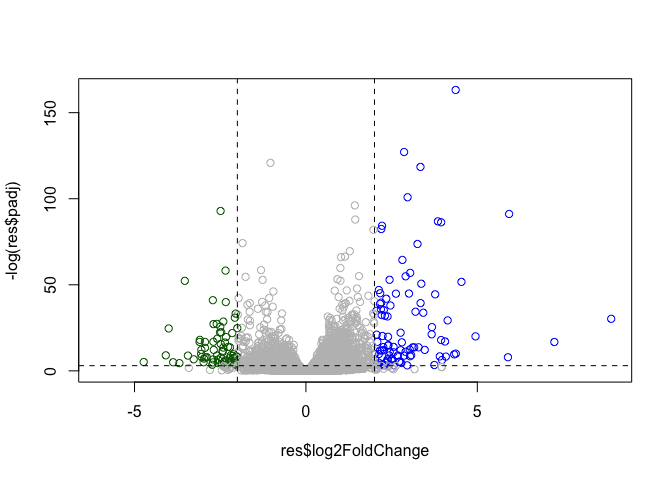
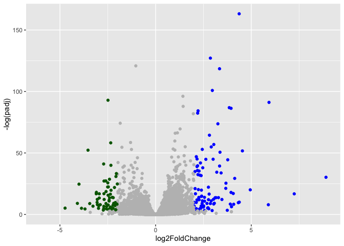

# Class 13
Joshua Khalil (A17784122)

- [Background](#background)
- [Data Import](#data-import)
- [Differential gene expression](#differential-gene-expression)
- [DESeq Analysis](#deseq-analysis)
- [Run the DeSeq analysis pipeline](#run-the-deseq-analysis-pipeline)
- [Volcano Plot](#volcano-plot)
- [Adding some color annotation](#adding-some-color-annotation)
- [Save my results](#save-my-results)
- [Adding annotation data](#adding-annotation-data)
- [Save annotated results to a CSV
  file](#save-annotated-results-to-a-csv-file)
- [Pathway Analysis](#pathway-analysis)

## Background

Today we will preform an RNASeq analysis of the effects of a common
sertoid in airway cells.

In Particular dexamethansone (hereafter called dex) on different airway
smooth muscle cell lines (ASM cells)

## Data Import

We need two different inputs: -**CountData**: with genes in a row and
experiment in columns -**Coldata**: meta data that describes the columns
in ContData

``` r
counts <- read.csv("airway_scaledcounts.csv", row.names=1)
metadata<- read.csv("airway_metadata.csv")
```

``` r
head(counts)
```

                    SRR1039508 SRR1039509 SRR1039512 SRR1039513 SRR1039516
    ENSG00000000003        723        486        904        445       1170
    ENSG00000000005          0          0          0          0          0
    ENSG00000000419        467        523        616        371        582
    ENSG00000000457        347        258        364        237        318
    ENSG00000000460         96         81         73         66        118
    ENSG00000000938          0          0          1          0          2
                    SRR1039517 SRR1039520 SRR1039521
    ENSG00000000003       1097        806        604
    ENSG00000000005          0          0          0
    ENSG00000000419        781        417        509
    ENSG00000000457        447        330        324
    ENSG00000000460         94        102         74
    ENSG00000000938          0          0          0

``` r
metadata
```

              id     dex celltype     geo_id
    1 SRR1039508 control   N61311 GSM1275862
    2 SRR1039509 treated   N61311 GSM1275863
    3 SRR1039512 control  N052611 GSM1275866
    4 SRR1039513 treated  N052611 GSM1275867
    5 SRR1039516 control  N080611 GSM1275870
    6 SRR1039517 treated  N080611 GSM1275871
    7 SRR1039520 control  N061011 GSM1275874
    8 SRR1039521 treated  N061011 GSM1275875

> Q1.How many genes are in this dataset?

``` r
nrow(counts)
```

    [1] 38694

There are 38694 genes in the dataset

> Q2. How many ‘control’ cell lines do we have?

``` r
sum(metadata$dex == "control")
```

    [1] 4

## Differential gene expression

We have 4 replicate drug treated and control columns in our `counts`
object.

We want one mean value for each gene (rows) in “treated” (drug) and one
mean value in each gene in “control” columns.

> Q3. How would you make the above code in either approach more robust?
> Is there a function that could help here?

Step 1. find all control columns

``` r
control.inds<- metadata$dex == "control"
```

Step 2. extract these columns to a new object, `control.counts`

``` r
 control.counts<- counts[ ,control.inds]
```

Step 3. Then calculate the mean value for each gene

``` r
control.mean<- rowMeans(control.counts)
```

> Q4. Follow the same procedure for the treated samples (i.e. calculate
> the mean per gene across drug treated samples and assign to a labeled
> vector called treated.mean)

``` r
treated.inds <- metadata$dex == "treated"

treated.counts <- counts[,treated.inds]
treated.mean <- rowMeans(treated.counts)
```

Put these together for easy book-keeping as `meancounts`

``` r
meancounts <- data.frame(control.mean, treated.mean)
plot(meancounts)
```


Lets log transform thus count data”

``` r
plot(meancounts, log= "xy") 
```

    Warning in xy.coords(x, y, xlabel, ylabel, log): 15032 x values <= 0 omitted
    from logarithmic plot

    Warning in xy.coords(x, y, xlabel, ylabel, log): 15281 y values <= 0 omitted
    from logarithmic plot


**N.B.** We must often use log2 for this type of data as it makes
interuptions more straightforward

Treated/Control is called “fold-change”

If there was no change we would have a log2-fc of zero

``` r
log2(10/10)
```

    [1] 0

If we had double the amount of transcript

``` r
log2(20/10)
```

    [1] 1

If we had half as much transcript around

``` r
log2(5/10)
```

    [1] -1

> Q. Calculate a log2 fold change value for all our genes and add it as
> a new column to our `meancounts` object.

``` r
meancounts$log2fc <- log2(meancounts$treated.mean/ meancounts$control.mean)

head(meancounts)
```

                    control.mean treated.mean      log2fc
    ENSG00000000003       900.75       658.00 -0.45303916
    ENSG00000000005         0.00         0.00         NaN
    ENSG00000000419       520.50       546.00  0.06900279
    ENSG00000000457       339.75       316.50 -0.10226805
    ENSG00000000460        97.25        78.75 -0.30441833
    ENSG00000000938         0.75         0.00        -Inf

## DESeq Analysis

Let’s do this analysis with an estimate of stastisical significance
using the **DESeq2** package.

``` r
library(DESeq2)
```

DESeq like many bioconductor packages, wants it input data on a very
specific way.

``` r
dds <- DESeqDataSetFromMatrix(countData = counts, 
                       colData = metadata,
                       design = ~dex)
```

    converting counts to integer mode

    Warning in DESeqDataSet(se, design = design, ignoreRank): some variables in
    design formula are characters, converting to factors

## Run the DeSeq analysis pipeline

``` r
dds <- DESeq(dds)
```

    estimating size factors

    estimating dispersions

    gene-wise dispersion estimates

    mean-dispersion relationship

    final dispersion estimates

    fitting model and testing

``` r
res <- results(dds)
head(res)
```

    log2 fold change (MLE): dex treated vs control 
    Wald test p-value: dex treated vs control 
    DataFrame with 6 rows and 6 columns
                      baseMean log2FoldChange     lfcSE      stat    pvalue
                     <numeric>      <numeric> <numeric> <numeric> <numeric>
    ENSG00000000003 747.194195      -0.350703  0.168242 -2.084514 0.0371134
    ENSG00000000005   0.000000             NA        NA        NA        NA
    ENSG00000000419 520.134160       0.206107  0.101042  2.039828 0.0413675
    ENSG00000000457 322.664844       0.024527  0.145134  0.168996 0.8658000
    ENSG00000000460  87.682625      -0.147143  0.256995 -0.572550 0.5669497
    ENSG00000000938   0.319167      -1.732289  3.493601 -0.495846 0.6200029
                         padj
                    <numeric>
    ENSG00000000003  0.163017
    ENSG00000000005        NA
    ENSG00000000419  0.175937
    ENSG00000000457  0.961682
    ENSG00000000460  0.815805
    ENSG00000000938        NA

## Volcano Plot

This is a main summary results figure from these kinds of studies. It is
a plot of Log2-foldchange vs Adjusted P-value.

``` r
plot(res$log2FoldChange,
     res$padj)
```


Again this y axis is highly needs log transforming and we can flip the
y-axis with a minus sign so it looks like every other volcano plot

``` r
plot(res$log2FoldChange,
     -log(res$padj))
abline(v=-2, col= "red")
abline(v=2, col= "red")
abline(h=-log(.05), col= "red")
```


## Adding some color annotation

Start with a default base color “gray”

``` r
mycols <-rep("grey", nrow(res))
mycols [ res$log2FoldChange > 2] <- "blue"
mycols [ res$log2FoldChange < -2] <- "darkgreen"
mycols [res$padj >= 0.05 ] <- "grey"
 

plot(res$log2FoldChange,
     -log(res$padj),
    col=mycols)


abline(v=c(-2,+2), lty=2)
abline(h=-log(.05), lty=2)
```



> . Make a ggplot version for presentation quality

``` r
library(ggplot2)
ggplot(res) + 
       aes(log2FoldChange, 
           -log(padj)) +
  geom_point(colour=mycols)
```

    Warning: Removed 23549 rows containing missing values or values outside the scale range
    (`geom_point()`).



``` r
labs(x= "Log2 Fold-Change", 
      y= "-log Adjusted P-value")
```

    <ggplot2::labels> List of 2
     $ x: chr "Log2 Fold-Change"
     $ y: chr "-log Adjusted P-value"

## Save my results

Write a csv file

``` r
write.csv(res, file="results.csv")
```

## Adding annotation data

Our result table so far only contains the Ensembl gene IDs. However,
alternative gene names and extra annotation are usually required for
informative interpretation of our results. In this section we will add
this necessary annotation data to our results.

We need to add missing annotations, to our main `res` results object.
This includes the common gene symbol

``` r
library("AnnotationDbi")
library("org.Hs.eg.db")
```

Lets see what databases we can use for translation/mapping

``` r
columns(org.Hs.eg.db)
```

     [1] "ACCNUM"       "ALIAS"        "ENSEMBL"      "ENSEMBLPROT"  "ENSEMBLTRANS"
     [6] "ENTREZID"     "ENZYME"       "EVIDENCE"     "EVIDENCEALL"  "GENENAME"    
    [11] "GENETYPE"     "GO"           "GOALL"        "IPI"          "MAP"         
    [16] "OMIM"         "ONTOLOGY"     "ONTOLOGYALL"  "PATH"         "PFAM"        
    [21] "PMID"         "PROSITE"      "REFSEQ"       "SYMBOL"       "UCSCKG"      
    [26] "UNIPROT"     

We will use R and bioconductor to do this “ID mapping”, We can use
`mapIds()` function now to “translate” any of these databases.

``` r
res$symbol <-mapIds(org.Hs.eg.db,
           keys=row.names(res),      # Our genenames
           keytype="ENSEMBL",        # Their format 
           column="SYMBOL")          # The format we want 
```

    'select()' returned 1:many mapping between keys and columns

``` r
head(res)
```

    log2 fold change (MLE): dex treated vs control 
    Wald test p-value: dex treated vs control 
    DataFrame with 6 rows and 7 columns
                      baseMean log2FoldChange     lfcSE      stat    pvalue
                     <numeric>      <numeric> <numeric> <numeric> <numeric>
    ENSG00000000003 747.194195      -0.350703  0.168242 -2.084514 0.0371134
    ENSG00000000005   0.000000             NA        NA        NA        NA
    ENSG00000000419 520.134160       0.206107  0.101042  2.039828 0.0413675
    ENSG00000000457 322.664844       0.024527  0.145134  0.168996 0.8658000
    ENSG00000000460  87.682625      -0.147143  0.256995 -0.572550 0.5669497
    ENSG00000000938   0.319167      -1.732289  3.493601 -0.495846 0.6200029
                         padj      symbol
                    <numeric> <character>
    ENSG00000000003  0.163017      TSPAN6
    ENSG00000000005        NA        TNMD
    ENSG00000000419  0.175937        DPM1
    ENSG00000000457  0.961682       SCYL3
    ENSG00000000460  0.815805       FIRRM
    ENSG00000000938        NA         FGR

> Q11. Run the mapIds() function two more times to add the Entrez ID and
> UniProt accession and GENENAME as new columns called
> res$entrez, res$uniprot and res\$genename.

``` r
res$entrez <- mapIds(org.Hs.eg.db,
                     keys=row.names(res),
                     column="ENTREZID",
                     keytype="ENSEMBL")
```

    'select()' returned 1:many mapping between keys and columns

``` r
res$uniprot <- mapIds(org.Hs.eg.db,
                     keys=row.names(res),
                     column="UNIPROT",
                     keytype="ENSEMBL")
```

    'select()' returned 1:many mapping between keys and columns

``` r
res$genename <- mapIds(org.Hs.eg.db,
                     keys=row.names(res),
                     column="GENENAME",
                     keytype="ENSEMBL")
```

    'select()' returned 1:many mapping between keys and columns

``` r
head(res)
```

    log2 fold change (MLE): dex treated vs control 
    Wald test p-value: dex treated vs control 
    DataFrame with 6 rows and 10 columns
                      baseMean log2FoldChange     lfcSE      stat    pvalue
                     <numeric>      <numeric> <numeric> <numeric> <numeric>
    ENSG00000000003 747.194195      -0.350703  0.168242 -2.084514 0.0371134
    ENSG00000000005   0.000000             NA        NA        NA        NA
    ENSG00000000419 520.134160       0.206107  0.101042  2.039828 0.0413675
    ENSG00000000457 322.664844       0.024527  0.145134  0.168996 0.8658000
    ENSG00000000460  87.682625      -0.147143  0.256995 -0.572550 0.5669497
    ENSG00000000938   0.319167      -1.732289  3.493601 -0.495846 0.6200029
                         padj      symbol      entrez     uniprot
                    <numeric> <character> <character> <character>
    ENSG00000000003  0.163017      TSPAN6        7105  A0A087WYV6
    ENSG00000000005        NA        TNMD       64102      Q9H2S6
    ENSG00000000419  0.175937        DPM1        8813      H0Y368
    ENSG00000000457  0.961682       SCYL3       57147      X6RHX1
    ENSG00000000460  0.815805       FIRRM       55732      A6NFP1
    ENSG00000000938        NA         FGR        2268      B7Z6W7
                                  genename
                               <character>
    ENSG00000000003          tetraspanin 6
    ENSG00000000005            tenomodulin
    ENSG00000000419 dolichyl-phosphate m..
    ENSG00000000457 SCY1 like pseudokina..
    ENSG00000000460 FIGNL1 interacting r..
    ENSG00000000938 FGR proto-oncogene, ..

You can arrange and view the results by the adjusted p-value

``` r
ord <- order( res$padj )
head(res[ord,])
```

    log2 fold change (MLE): dex treated vs control 
    Wald test p-value: dex treated vs control 
    DataFrame with 6 rows and 10 columns
                     baseMean log2FoldChange     lfcSE      stat      pvalue
                    <numeric>      <numeric> <numeric> <numeric>   <numeric>
    ENSG00000152583   954.771        4.36836 0.2371306   18.4217 8.79214e-76
    ENSG00000179094   743.253        2.86389 0.1755659   16.3123 8.06568e-60
    ENSG00000116584  2277.913       -1.03470 0.0650826  -15.8983 6.51317e-57
    ENSG00000189221  2383.754        3.34154 0.2124091   15.7316 9.17960e-56
    ENSG00000120129  3440.704        2.96521 0.2036978   14.5569 5.27883e-48
    ENSG00000148175 13493.920        1.42717 0.1003811   14.2175 7.13625e-46
                           padj      symbol      entrez     uniprot
                      <numeric> <character> <character> <character>
    ENSG00000152583 1.33157e-71     SPARCL1        8404      B4E2Z0
    ENSG00000179094 6.10774e-56        PER1        5187      A2I2P6
    ENSG00000116584 3.28806e-53     ARHGEF2        9181  A0A8Q3SIN5
    ENSG00000189221 3.47563e-52        MAOA        4128      B4DF46
    ENSG00000120129 1.59896e-44       DUSP1        1843      B4DRR4
    ENSG00000148175 1.80131e-42        STOM        2040      F8VSL7
                                  genename
                               <character>
    ENSG00000152583           SPARC like 1
    ENSG00000179094 period circadian reg..
    ENSG00000116584 Rho/Rac guanine nucl..
    ENSG00000189221    monoamine oxidase A
    ENSG00000120129 dual specificity pho..
    ENSG00000148175               stomatin

## Save annotated results to a CSV file

``` r
write.csv(res, file="results_annotated.csv")
```

## Pathway Analysis

What known biological pathways do out differentially expressed genes
overlap with (i.e. play a role in)?

There are lots of biolconductor packages to do this type of analysis.

We will use one of the oldest called **gage** along with **pathview** to
render nice pics of the pathway we find.

We can install with the command:
`BiocManager::install( c("pathview", "gage", "gageData") )`

``` r
library(pathview)
library(gage)
library(gageData)
```

We have a wee peak what is in `gageData`

``` r
data(kegg.sets.hs)

# Examine the first 2 pathways in this kegg set for humans
head(kegg.sets.hs, 2)
```

    $`hsa00232 Caffeine metabolism`
    [1] "10"   "1544" "1548" "1549" "1553" "7498" "9"   

    $`hsa00983 Drug metabolism - other enzymes`
     [1] "10"     "1066"   "10720"  "10941"  "151531" "1548"   "1549"   "1551"  
     [9] "1553"   "1576"   "1577"   "1806"   "1807"   "1890"   "221223" "2990"  
    [17] "3251"   "3614"   "3615"   "3704"   "51733"  "54490"  "54575"  "54576" 
    [25] "54577"  "54578"  "54579"  "54600"  "54657"  "54658"  "54659"  "54963" 
    [33] "574537" "64816"  "7083"   "7084"   "7172"   "7363"   "7364"   "7365"  
    [41] "7366"   "7367"   "7371"   "7372"   "7378"   "7498"   "79799"  "83549" 
    [49] "8824"   "8833"   "9"      "978"   

The main `gage()` function that does the actual work, wants a simple
vector as input.

``` r
foldchanges <- res$log2FoldChange
names(foldchanges) <- res$symbol
head(foldchanges)
```

         TSPAN6        TNMD        DPM1       SCYL3       FIRRM         FGR 
    -0.35070296          NA  0.20610728  0.02452701 -0.14714263 -1.73228897 

The KEGG database uses ENTREZ ids so we need to provide these in our
input vector for **gage**

``` r
names(foldchanges) <- res$entrez
```

Now we can run `gage()`

``` r
# Get the results
keggres = gage(foldchanges, gsets=kegg.sets.hs)
```

What is in the output object `keggres`

``` r
attributes(keggres)
```

    $names
    [1] "greater" "less"    "stats"  

Lets look at the first few down (less) pathway results that are
down-regulated:

``` r
# Look at the first three down (less) pathways
head(keggres$less, 3)
```

                                          p.geomean stat.mean        p.val
    hsa05332 Graft-versus-host disease 0.0004250607 -3.473335 0.0004250607
    hsa04940 Type I diabetes mellitus  0.0017820379 -3.002350 0.0017820379
    hsa05310 Asthma                    0.0020046180 -3.009045 0.0020046180
                                            q.val set.size         exp1
    hsa05332 Graft-versus-host disease 0.09053792       40 0.0004250607
    hsa04940 Type I diabetes mellitus  0.14232788       42 0.0017820379
    hsa05310 Asthma                    0.14232788       29 0.0020046180

We can use **pathview** function to render a figure of any of these
pathways along with annotations for our DEGs (differentially expressed
genes)

Let’s see the hsa05310 Asthma pathway with our DEGs colored up

``` r
pathview(gene.data=foldchanges, pathway.id="hsa05310")
```

    'select()' returned 1:1 mapping between keys and columns

    Info: Working in directory /Users/joshuakhalil/Desktop/git_play/bimm143_github.git/Class13

    Info: Writing image file hsa05310.pathview.png


> Q can you do this for “Graft vs Host diseases” and “Type I diabetes”

Graft-versus-host disease

``` r
pathview(gene.data=foldchanges, pathway.id="hsa05332")
```

    'select()' returned 1:1 mapping between keys and columns

    Info: Working in directory /Users/joshuakhalil/Desktop/git_play/bimm143_github.git/Class13

    Info: Writing image file hsa05332.pathview.png


hsa04940 Type I diabetes mellitus

``` r
pathview(gene.data=foldchanges, pathway.id="hsa04940")
```

    'select()' returned 1:1 mapping between keys and columns

    Info: Working in directory /Users/joshuakhalil/Desktop/git_play/bimm143_github.git/Class13

    Info: Writing image file hsa04940.pathview.png


